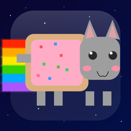
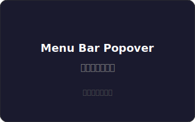
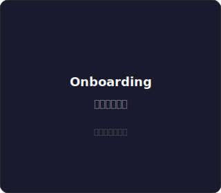
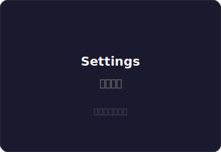

<div align="center">



# CatWhisper

**macOS 選單列語音轉文字工具**

按住 fn 說話，放開自動辨識，文字直接輸入到游標位置。

全程離線，資料不離開你的電腦。

[](LICENSE)
[](https://www.apple.com/macos/)
[](https://swift.org)
[](#系統需求)

</div>

---

## 特色

<table>
<tr>
<td width="50%" valign="top">

### 按住 fn，說話就好
不需要切換視窗、不需要打開 App。在任何應用程式中按住 fn 鍵說話，放開後辨識結果自動輸入到游標位置。

</td>
<td width="50%" valign="top">

### 完全離線辨識
使用 [Qwen3-ASR](https://github.com/ivan-digital/qwen3-asr-swift) 模型，透過 Apple MLX 框架在本機推論。你的語音資料永遠不會離開你的電腦。

</td>
</tr>
<tr>
<td width="50%" valign="top">

### Notch 動態島狀態
錄音與辨識狀態以膠囊形式顯示在螢幕頂部 notch 旁邊，帶有流暢的 spring 動畫。不會打斷你的工作流程。

</td>
<td width="50%" valign="top">

### Nyan Cat 選單列
Menu bar 上的 Nyan Cat 圖標會隨著 App 狀態改變表情 — 待命時正常眼、錄音時戴耳機、辨識時瞇眼、出錯時 X 眼。

</td>
</tr>
</table>

## 截圖

> 以下截圖展示 CatWhisper 的主要介面。歡迎替換為你自己的截圖。

<div align="center">
<table>
<tr>
<td align="center"><br><b>選單列彈出視窗</b></td>
<td align="center"><br><b>首次設定引導</b></td>
</tr>
<tr>
<td align="center"><br><b>Notch 動態島</b></td>
<td align="center"><br><b>設定視窗</b></td>
</tr>
</table>
</div>

> **提示：** 將實際截圖放到 `docs/images/` 資料夾，命名為 `screenshot-menubar.png`、`screenshot-onboarding.png` 等，然後更新上方的圖片路徑。

## 系統需求

| 項目 | 需求 |
|------|------|
| 作業系統 | macOS 14.0 (Sonoma) 或更新 |
| 處理器 | Apple Silicon (M1 / M2 / M3 / M4) |
| 磁碟空間 | ~400MB（預設模型，首次啟動自動下載） |
| 權限 | 麥克風、輔助使用（可選） |

## 安裝

### 下載 Release

前往 **[Releases](https://github.com/koobraelc/CatWhisper/releases)** 下載最新的 `.dmg`，拖曳到應用程式資料夾即可。

### 從原始碼建置

```bash
# 1. Clone
git clone https://github.com/koobraelc/CatWhisper.git
cd CatWhisper/CatWhisper

# 2. 產生 Xcode 專案（需要 xcodegen）
brew install xcodegen
xcodegen generate

# 3. 用 Xcode 開啟
open CatWhisper.xcodeproj
```

或使用命令列建置：

```bash
xcodebuild build \
  -scheme CatWhisper \
  -configuration Release \
  -destination 'platform=OS X' \
  -skipPackagePluginValidation
```

## 使用方式

```
1. 啟動 CatWhisper → 出現在選單列（Nyan Cat 圖標）
2. 首次啟動 → 引導授權麥克風和輔助使用權限
3. 等待模型下載 → 首次約 1-2 分鐘
4. 在任何 App 中按住 fn → 開始說話
5. 放開 fn → 辨識結果自動輸入到游標位置
```

### 權限說明

| 權限 | 用途 | 必要性 |
|------|------|--------|
| 麥克風 | 錄製語音進行辨識 | 必要 |
| 輔助使用 | 自動將文字輸入到其他 App | 選用（未授權則複製到剪貼簿） |

## 模型

CatWhisper 使用 [Qwen3-ASR](https://github.com/ivan-digital/qwen3-asr-swift) 語音辨識模型，在設定中可以切換：

| 模型 | 大小 | 速度 | 精度 | 適用場景 |
|------|------|------|------|----------|
| Qwen3-ASR 0.6B (4-bit) | ~400MB | 快 | 良好 | 日常使用（預設） |
| Qwen3-ASR 1.7B (8-bit) | ~2.5GB | 中等 | 更高 | 需要更高精度時 |

模型會在首次選擇時自動從 Hugging Face 下載，之後完全離線運行。

## 技術架構

```
CatWhisper/
├── App/
│   ├── CatWhisperApp.swift     # App 入口，MenuBarExtra
│   └── AppState.swift          # 狀態機 (idle → recording → transcribing)
├── Audio/
│   ├── AudioRecorder.swift     # AVAudioEngine 錄音
│   └── AudioBuffer.swift       # 音訊緩衝處理
├── Transcription/
│   └── TranscriptionEngine.swift  # Qwen3-ASR MLX 推論
├── Input/
│   ├── TextInjector.swift      # Accessibility API 文字注入
│   └── AccessibilityChecker.swift
├── Hotkey/
│   └── FnKeyMonitor.swift      # fn 鍵全域監聽
├── Permissions/
│   └── PermissionManager.swift
└── UI/
    ├── MenuBarView.swift       # 選單列彈出視窗
    ├── NotchOverlay.swift      # Notch 動態島 (NSPanel)
    ├── OnboardingView.swift    # 首次設定引導
    ├── SettingsView.swift      # 設定視窗
    └── StatusItemIcon.swift    # Nyan Cat 像素圖標
```

**核心技術：**
- **[MLX Swift](https://github.com/ml-explore/mlx-swift)** — Apple Silicon 上的機器學習框架
- **[Qwen3-ASR](https://github.com/ivan-digital/qwen3-asr-swift)** — 語音辨識模型
- **AVAudioEngine** — 即時音訊錄製
- **Accessibility API** — 跨 App 文字注入
- **NSPanel** — 無邊框浮動 overlay（Notch 動態島）

## 常見問題

<details>
<summary><b>按 fn 沒有反應？</b></summary>

1. 確認選單列有看到 Nyan Cat 圖標，且狀態為「待命中」
2. 確認模型已下載完成（不是顯示「載入模型中 XX%」）
3. 檢查系統設定 → 鍵盤 → 確認 fn 鍵行為設定

</details>

<details>
<summary><b>辨識結果沒有自動輸入？</b></summary>

需要授權「輔助使用」權限。前往：系統設定 → 隱私與安全性 → 輔助使用 → 加入 CatWhisper。

若已授權仍無法使用，請先移除舊的 CatWhisper，再重新加入。

</details>

<details>
<summary><b>辨識精度不夠好？</b></summary>

可以在設定中切換到較大的 1.7B 模型，精度會更高但速度稍慢。

</details>

<details>
<summary><b>支援哪些語言？</b></summary>

目前主要支援中文（繁體中文輸出）。Qwen3-ASR 模型本身也支援英文等其他語言。

</details>

## Roadmap

- [ ] 自訂快捷鍵（不只 fn）
- [ ] 多語言辨識切換
- [ ] 即時串流辨識（邊說邊顯示）
- [ ] Homebrew Cask 安裝
- [ ] 辨識結果後處理（標點符號優化）

## 貢獻

歡迎貢獻！請參閱 [CONTRIBUTING.md](CONTRIBUTING.md)。

無論是 bug 回報、功能建議、或直接提交 PR，都非常感謝。

## 致謝

- [Qwen3-ASR](https://github.com/ivan-digital/qwen3-asr-swift) — 語音辨識模型
- [MLX Swift](https://github.com/ml-explore/mlx-swift) — Apple 機器學習框架
- [Nyan Cat](https://www.nyan.cat/) — 經典迷因，啟發了我們的圖標設計

## 授權條款

本專案採用 [MIT License](LICENSE) 授權 — 可自由使用、修改、分發。
